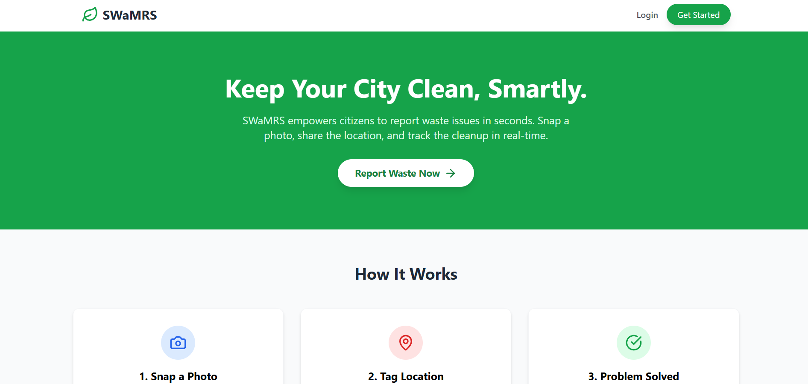

# SWaRMS (Smart Waste & Reporting Management System)

## 🌐 Live Demo
Click below to use the application:
### 🚀 [**Launch SWaRMS App**](https://swarms-fullstack-project.vercel.app)

---

## 💡 About The Project
**SWaRMS** is a Full Stack solution designed to modernize municipal waste management. It bridges the gap between citizens and authorities by providing a real-time, geo-tagged reporting platform.

I built this project to solve the issue of delayed waste collection. Unlike simple forms, this is a complete ecosystem that tracks a report from "Uploaded" to "Resolved," with a secure admin dashboard for management.

---

## 🛠️ Tech Stack & Features
This application is built on the **MERN Stack** (MongoDB, Express, React, Node.js) to ensure scalability and speed.

| Feature | Technology | Why I Used It |
| :--- | :--- | :--- |
| **Security** | **JWT (JSON Web Tokens)** | Custom-built stateless authentication system (No external tools). |
| **Image Handling** | **Multer + Node.js** | Secure server-side processing of evidence photos. |
| **Database** | **MongoDB Atlas** | Cloud-native NoSQL database for handling complex location data. |
| **Frontend** | **React + Tailwind** | Mobile-first architecture for field usage. |

---

## 🔒 Copyright & License
**Copyright © 2026 Aaditya M. Channe**

This project is the intellectual property of Aaditya M. Channe.
* **Recruiters/Viewers:** You are welcome to view the code and test the live demo to evaluate my skills.
* **Restrictions:** Copying, cloning, or distributing this codebase for commercial use without permission is strictly prohibited.

---

## 👨‍💻 Author
**Aaditya M. Channe**
* **Role:** Full Stack Developer
* **Location:** Maharashtra, India